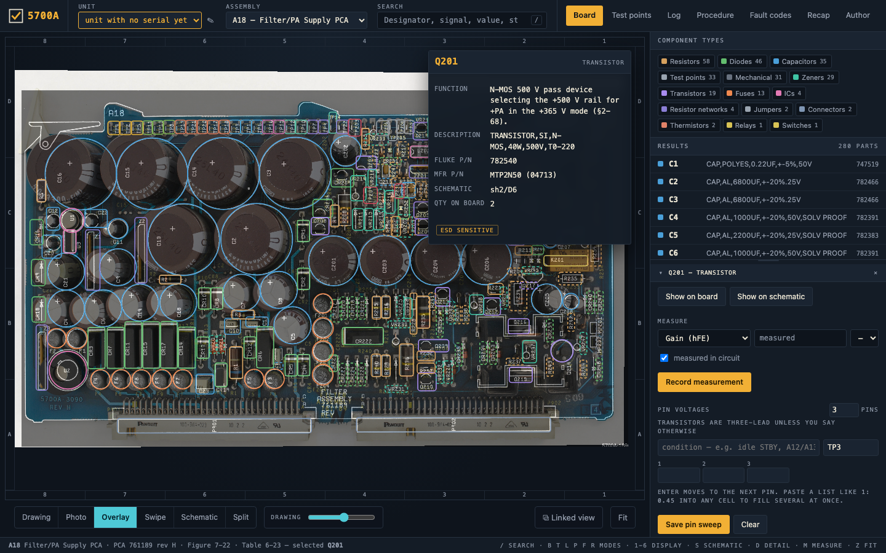
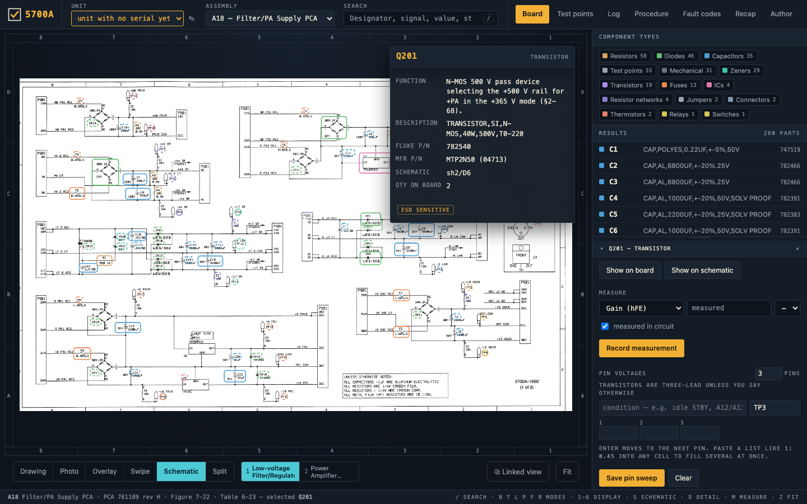
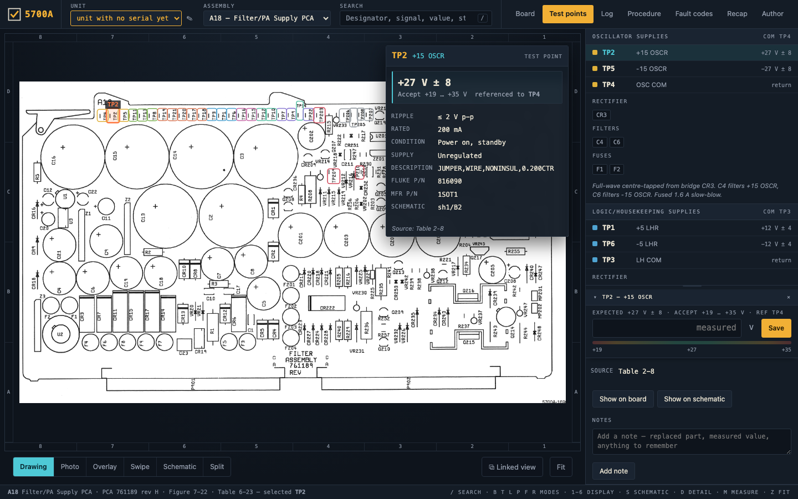
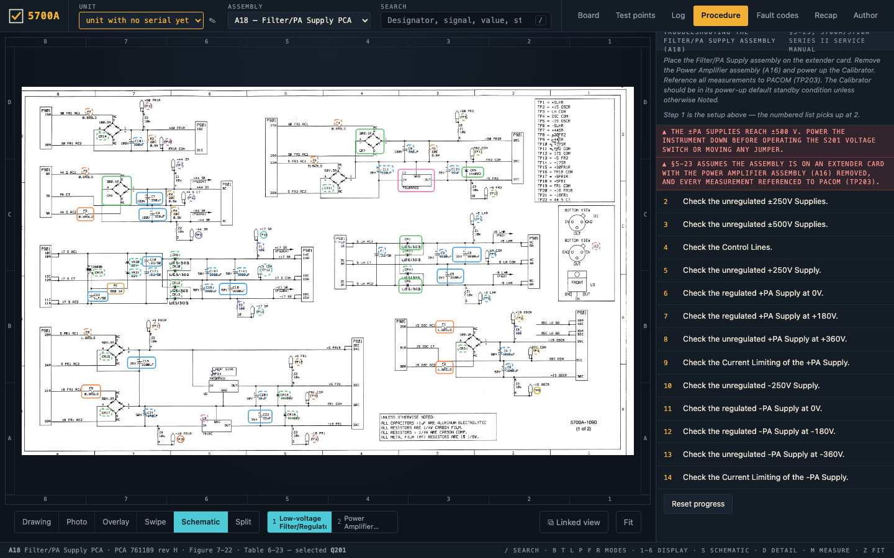

# Fluke 5700A Atlas

A bench tool for servicing the Fluke 5700A/5720A calibrator: find a part on the
board, see what a test point should read and what to reference it against, step
through the manual's troubleshooting procedure, and record what you measured so
the readings are still there next year.

Standalone HTML: open `index.html` in a browser and it works. No server, no
build step, no install, no network.

Covers twenty assemblies: **A4 Digital Motherboard**, **A5 Wideband Output**,
**A6 Wideband Oscillator**, **A7 Current/High-Resolution Oscillator**, **A8 Switch
Matrix**, **A9 Ohms Cal**, **A10 Ohms Main**, **A11 DAC**, **A12 Oscillator
Control**, **A13 Oscillator Output**, **A13A1 Oscillator Wideband SMD**, **A14 High
Voltage Control**, **A15 High Voltage/High Current**, **A16 Power Amplifier**,
**A16A1 Power Amplifier Digital Control SIP**, **A17 Regulator/Guard Crossing**,
**A18 Filter/PA Supply**, **A19 Digital Power Supply**, **A20 CPU** and **A21 Rear
Panel**. The engine is assembly-agnostic — each board is a data file plus its
images, and adding one is a data job.

## What it looks like

**Board view.** The photograph overlaid on the locator drawing, every part
boxed and coloured by family, and the part card for the one you clicked:
function, parts-list description, Fluke and manufacturer part numbers, and
where it sits on the schematic.



**Schematic view.** The same selection carried across to the schematic sheet,
with every marker the reader and the reviewer placed.



**Test points.** Grouped by supply rail with nominal, acceptable range,
reference point, ripple and source table; click one and the board pans to it
and the card opens for the reading you are about to take.



**Procedure.** The manual's own troubleshooting steps for the board, with the
setup, the hazards and progress ticked off as you go.



---

## Safety and disclaimer

**Read this before opening the instrument.**

### Lethal voltages

A Fluke 5700A/5720A contains voltages that will kill you. The power amplifier
supplies run at up to **±365 V**, the high-voltage section generates **±500 V**,
and the High Voltage Control assembly carries a **1100 V** transformer with
several hundred volts standing across its filter capacitor. Reservoir
capacitors hold a lethal charge after the instrument is switched off and
unplugged.

Opening, servicing or repairing the instrument is done entirely at your own
risk. Do not attempt it unless you are competent to work on live high-voltage
equipment, and follow proper safety procedure: isolate the supply, confirm
capacitors are discharged before touching anything, keep one hand away from the
chassis, and never work alone.

### The information here may be wrong

This tool is provided **as is**, with no warranty of any kind. Its data is
derived from service manuals by a mixture of text extraction, optical character
recognition and hand correction, and any part of it may be inaccurate,
incomplete or out of date — a misplaced marker, a mistyped tolerance, a rail
traced to the wrong net.

Use it at your own risk, and **cross-check anything that matters against the
official Fluke service documentation** before acting on it. Treat it as a way
of finding your way around the manuals, not as a replacement for them.

### No liability

The author accepts no responsibility or liability whatsoever for any direct,
indirect, incidental or consequential damage, loss, injury or other
consequence arising from the use of this tool or of the information in it,
however caused. See `LICENSE` for the full terms.

---

## What it does

**Find a part.** Type a designator (`C13`), a signal name (`+17 SR`), a value
(`3300UF`), a Fluke stock number (`782458`) or a manufacturer part number. The
board pans and zooms to it. Partial matches highlight every hit at once, so
`VR2` lights up all the PA-side zeners.

**Know what to expect.** Test point mode shows only the test points, coloured by
supply rail. Each one carries its nominal, its acceptable range, the point to
reference it against, the maximum ripple, the rated output, and the table or
manual section that value came from. High-voltage points carry the hazard
warning printed on the schematic.

The ±PA rails have no single correct voltage — what they should read depends on
which mode the supply is jumpered into — so those points carry a list of modes,
each with its own expected value and the jumper setup that produces it.

**Record measurements.** Start a session, click a test point, type what your
meter reads. The tool computes the deviation in volts and as a percentage of
nominal, scores it green / amber / red, and colours the marker on the board so
the board itself becomes a pass/fail map. Sessions carry the instrument serial,
technician, meter and ambient conditions, and export to JSON and CSV. The
history view shows the same point across past sessions, which is where a supply
slowly drifting inside its tolerance becomes visible.

**Sweep the pins of an IC or a transistor.** Select a `U` or `Q` part and a grid
of pin cells appears. Enter walks the pins; a list pasted into any cell fills
several at once, in the `1: 0.45` shape people already write these in by hand.
Leave a pin blank and it stays unmeasured rather than becoming a claim of 0 V.
Each sweep is one record carrying the condition it was taken in — "idle STBY,
A12/A13 out" — because nothing published says what a pin should read, so the
only useful comparison is against the previous sweep, and pins that moved since
then are marked. Fewer than one IC in five states its pin count in the parts
list, so the count is a guess that says it is one and can be corrected; the
correction rides on the sweep and becomes the default next time.

**Follow the procedure.** §5-23's fourteen steps, each with the jumper setup it
needs, the measurements it calls for, and the parts to check when it fails —
clicking one highlights it on the board.

Each step's measurements are entered where the step is read. Every point it
asks about gets a box showing what it should read and what to reference it
against; type what your meter says and it scores as you go, then *Record
entered values* writes them to the session log. **Nothing is required** — a
step may name four points and you may only have taken two, so blank boxes are
simply skipped rather than treated as failures. `Enter` moves to the next
point, and on the last one records the step. A session is started for you if
none is open.

Each step carries its own state in the list, so a fourteen-step procedure can
be read with every card shut: the step number and a bar down its left edge take
the colour of the worst reading it holds, and a word in the head says where it
stands — *2 of 4* while you are still working through it, then *all in
tolerance*, *near limit* or *out of tolerance*. Recorded readings count as well
as typed ones, so the picture is still there tomorrow morning.

Where a point reads differently depending on how the supply is jumpered, the
step preselects its own mode: step 8 asks TP201 and TP210 for their +360 V
values because that is the mode step 8 sets up, so a reading is never scored
against the wrong expectation.

Pointing at any row — or any part in any list — rings that part on the board
with an amber reticle. **The view does not move**: you are already looking at
the part of the board you are working on, and having it jump on every hover
would be worse than useless. When the part happens to be outside the current
view, an arrow at the edge says which way it lies instead of highlighting
nothing. A probe point like "VR211 cathode" rings VR211, since that is the
component you have to find.

**Start from a fault code.** The instrument reports 3604, or 3610, and the fault
code index says what to measure on A18, what it should read, and — the part that
matters — which assembly is at fault depending on the answer.

**Look at it however helps.** Board drawing, photograph, the two blended with an
opacity slider, a swipe split, any of the board's schematic sheets — A11 has
six, A14 four — or board and schematic side by side with the selection
synchronised. Clicking a part turns the schematic to the sheet it is drawn on. Select a part and press `S` to
jump to it on the schematic, or jump back the other way.

**Put the schematic on the other monitor.** *⧉ Linked view* opens a view-only
window that follows this one: same board, same selected part, same search
hits, its own zoom and its own display — so the board sits on one screen and
the schematic turns its own pages on the other. Followers never record;
readings taken in the main window colour their markers as they land. The
link survives a reload on either side, and two main windows never share
followers.

**Write things down.** Any part or test point takes free-text notes — "C13
replaced 2026-08, ESR was 0.9 Ω". Notes live in their own storage, keyed
separately from the dataset, so rebuilding the data from the manuals never
destroys them.

### The service record

Everything you record belongs to **one calibrator, identified by its serial
number** — readings, repairs and notes alike. A note written while servicing
one 5700A must not appear while working on another, and two instruments on a
bench is ordinary. The unit picker sits beside the assembly picker and stays
out of the way until there is a second one to choose between; it turns amber
while the serial is still blank.

- **Measure anything, not just test points.** A test point is scored against
  the manual. A component is scored against its own parts-list entry where that
  entry states a value — `CAP,AL,3300UF,+-20%,50V` gives 3300 µF ±20% — and left
  unscored where it does not, which is most of the BOM. Resistance,
  capacitance, ESR, forward drop, leakage, gain and the rest each carry their
  own units, and each reading records **whether it was taken in circuit**,
  because a resistor measured in circuit reads low through everything parallel
  with it and a number that does not say which is quietly misleading.
- **Record what was faulty and what went in.** *Mark suspect*, *Mark faulty* or
  *Replaced…* on the part's own card. Suspect and faulty are separate from
  replaced on purpose: a part can be known bad with the replacement still on
  order, and a part can be replaced without ever having been faulty — recapping
  a supply is exactly that. What came out is prefilled from the parts list,
  since the manual already says what should be there; what went in starts as a
  copy of it and carries a **substitute** flag when it is not the specified part.
- **Find them again.** The Board panel grows chips for *faulty or suspect*,
  *replaced*, *measured* and *annotated*, which filter the list to those parts.
  The Log tab carries the full repair log for the board, across every visit —
  what matters when a board comes back is what has ever been done to it.
- **One file, in and out.** *Export log* writes this unit's readings, repairs
  **and** notes as a single JSON file named after its serial. *Open a log…*
  merges one back in and never replaces what is already there, so having one
  instrument's history open costs you nothing of another's. Units are matched
  **on serial number**, not on the id inside the file, so the same calibrator
  logged on two benches comes back as one instrument rather than two halves.
  Re-opening the same file twice adds nothing.
- **Service report.** A standalone, printable HTML file: the serial at the top,
  a summary, then per board the parts replaced, every visit with its test-point
  and component measurements, and the notes. Self-contained, so it survives
  being emailed and prints to PDF without a toolchain. Measured values and
  published limits are printed as they were taken and as the manual states them
  — the board display rounds a rail to whole volts, and a report must not.

### Keyboard

| Key | |
|---|---|
| `/` | search |
| `B` `T` `L` `P` `F` | board · test points · log · procedure · fault codes |
| `1`–`6` | drawing · photo · overlay · swipe · schematic · split |
| `S` | show the selection on the schematic |
| `Z` | fit to view |
| `Esc` | clear selection |

---

## Where the data comes from

Everything is traceable to a printed source, and the app shows the citation.
The table below is **A18's**, as one worked example; every board has its own
sources, and each generated `data/<asm>.js` names them in its header.

| Data | Source |
|---|---|
| Board drawing | Figure 7-22, Chapter 7 Schematic Diagrams (Rev 9), page 82 |
| Schematic sheets 1–2 | same PDF, pages 83–84 |
| Test point signal names | the legend boxes on schematic sheets 1 and 2 |
| Expected voltages, tolerances, ripple, rated output | Tables 2-8 and 2-9 |
| Parts list | Table 6-23 of the 1996 Series II manual (text) merged with Table 6-23 of the Rev 9 manual (scanned, for the manufacturer columns) |
| Troubleshooting procedure | §5-23 |
| Fault codes | §5-2 |
| Circuit descriptions | §2-22, §2-56 – §2-69 |
| Photograph | `Photos/a18_top.jpg`, a REV H board — like most board photographs here, from [xDevs.com](https://xdevs.com/fix/f5700a/); see `CREDITS.md` |

Three corrections were made to the printed tables, each recorded in
`data/a18.testpoints.json`:

1. Tables 2-8 and 2-9 print negative rails as unsigned magnitudes (`-44 SR …
   60V` means −60 V). Every nominal in the dataset is signed.
2. The `+30 FR2R` row of Table 2-8 is shifted one cell and loses its nominal.
   50 V is taken from the identical `+30 FR1R` circuit.
3. TP206 carries an expected value the manual does not state outright: §5-23
   step 4 gives +12 V ±4 V for TP205/207/208 only, but §2-66 says Z201 pulls all
   four control lines up the same way. It is flagged as inferred in the UI.

The two parts lists disagree in about a dozen places because the board was
revised. Where they do, the Rev 9 entry — the revision that matches this
drawing and this photograph — is shown as "Rev 9 as built" alongside the later
part. F201–F204 disagree between the parts list (0.2 A) and the schematic
annotation ("2A"); both are shown, with a note.

### How positions were arrived at

The app says which of these applies to any given marker:

| | |
|---|---|
| **checked by hand** | someone looked at the drawing and placed or confirmed it |
| **passes agreed** | read off the drawing by OCR, and several independent passes with different tiling, scaling and thresholds landed on the same spot |
| **uncertain** | the passes disagreed; the most-voted position was taken |
| **unconfirmed** | one pass found it and nothing corroborates it |

All 33 test points are hand-placed on the board, because a test point marker
has to sit on the pad you actually probe rather than on the text beside it —
and getting that wrong is the one error that would send a probe to the wrong
place.

On the schematic they are hand-checked too, for a different reason. Every test
point is written twice on a sheet: once in the legend table that names its
signal, and once beside the symbol on the net. The table is the cleaner text,
so the reader prefers it — and a marker pointing at a table row answers a
question nobody asked. The build now prefers the reading out in the circuit and
reports any it could only find in the table; those, and the ones the reader
misidentified, are placed by hand in `data/a18.coords.overrides.json` under
`schematic`. Each of the 33 was then checked against the signal name printed
beside its symbol. 28 parts
(heat sinks, insulators, washers, screws, nuts, rivets, ejectors) carry no
silkscreen designator at all; they stay in the parts list and remain
searchable, but there is nothing on the drawing to point at.

The photograph's alignment is a **starting fit** from the four edges of the PCB,
good to roughly a millimetre near the centre and looser at the corners. Author
Mode's landmark editor re-solves it from as many correspondences as you care to
add.

---

## Editing: Author Mode

Open `index.html?author=1`.

- **Draw an outline from scratch.** Pick the shape — **Box**, **Circle** or
  **Point** — then *Draw on board*, or click a part in the missing list, and
  sweep the outline out on the drawing. It is one gesture instead of dropping a
  box and dragging four edges onto the part, and it is the only way to size
  something smaller than the 24 px at which the handles appear without zooming
  in first.

  The two shapes are swept differently, because the drawing gives you different
  things to aim at. A **box** is drawn corner to corner, which is where a
  rectangular part shows its own corners. A **circle** is drawn *rim to rim
  across the middle* — the drag is a diameter, not the diagonal of a box —
  because nothing marks the centre of a can, and taking two rim points as box
  corners would draw a circle about 30% too small. A faint line along the drag
  shows whether you crossed the middle or cut a chord.

  `Shift` squares a box; a circle is round already, whatever the board's
  proportions. `Alt` works from the centre out, for the rare part whose centre
  *is* marked. `B`, `C` and `P` switch shape mid-placement, `Esc` cancels, and a
  plain click with no drag still drops a default box the way it always did.
- **Snap it to the printed outline.** With *Snap* on, a shape that has just
  been swept is fitted to the ink underneath it: box sides move onto the
  nearest solid line, and a circle is fitted by casting rays out from the
  centre. Drawn by hand to within a few percent, A18's component bodies land a
  pixel or so off — a median of 12 px of error becomes 1.5 px.

  It is allowed to move a boundary by at most **15%** of the drawn size. Past
  that it leaves the shape alone rather than dragging it to the limit, because
  an outline that far away is a different part, not a correction — and it says
  so. It reads the **drawing only**, never the photograph, and switches itself
  off while the photo is on screen: an edge finder that works on line art is
  not merely less accurate on a photograph of a green board under uneven light,
  it is confidently wrong. Turn *Snap* off to place a shape exactly as drawn.

  Reading pixels needs a canvas the browser will let us read back, and one that
  has had a `file://` image drawn into it is off limits, so snapping is
  unavailable when the page is opened straight off disk — it says so once and
  everything else still works. Serve the directory to get it back:
  `python3 -m http.server` and open `http://127.0.0.1:8000/index.html?author=1`.
- **Throw one away and start again.** `Del` (or `Backspace`) on the selected
  marker clears its outline in the view you are in and waits for you to draw a
  new one, with the tool already set to the shape you just deleted. On a sheet
  it removes the one occurrence you were pointing at, not every occurrence.
  Undo brings it back.
- **Move things.** Click a marker to select it, then drag to move — the box
  follows the pointer as you go. Arrow keys nudge by one part in a thousand of
  the board width, `Shift` for ten. The same works on the schematic sheets.
  Where markers
  overlap — TP201's pad falls inside P901's outline — a press grabs the
  smaller one, so select the buried part from the search results or a list
  first; once selected, a press inside it grabs it whatever is drawn on top.
- **Undo.** `Cmd`/`Ctrl`+`Z`, `Shift` to redo, or the buttons at the top of the
  Author panel, which name the step they will take back. A run of arrow-key
  nudges counts as one step. Every edit is covered: moves, resizes, placements,
  renames, inspector fields, landmark pairs.
- **Resize by its handles.** The selection carries handles on its corners and
  edges; drag one and that side moves while the opposite side stays put, with
  the pointer showing which way it will go. They appear once the box is big
  enough on screen to aim at — below that, zoom in. `Alt`+drag anywhere on the
  box still sizes it about its centre.
- **The drawing is the boundary.** A box cannot be moved, nudged, placed or
  typed past the edge of the drawing — the whole box, not just its centre —
  because nothing out there is clickable. Grow one beyond the board and it
  clamps to the board and centres.
- **Get something back that went off the edge.** Positions stored that way by
  an earlier version have nothing left to click, so the **Off the board** panel
  lists them —
  select it there, then undo, or *Restore from file* to put that one item back
  where the data file has it without touching your other edits.
- **Place what is missing.** The panel lists what has no position *in the view
  you are in*: on the board, parts with no board position; on a sheet, parts
  drawn on neither sheet. Click one, then sweep out where it belongs. A part
  placed on a sheet takes its printed grid zone straight away, and keeps it up
  to date as you move it.
- **Edit anything.** The inspector exposes every field on the selected item —
  description, stock numbers, kind, and for a test point its signal, rail,
  reference point, nominal, tolerance, ripple, condition, hazard and each of its
  operating modes. Duplicate designators and dangling reference points are
  refused.
- **Fix the photo alignment.** *Photo landmarks* → click a feature on the
  drawing, then the same feature on the photo. Four pairs minimum; each extra
  pair tightens the fit, and per-landmark residuals show which one is bad.
- **Export.** *Export coordinates* writes `data/a18.coords.json`; *Export data
  file* writes the whole dataset. Edits are held in local storage continuously,
  so closing the tab loses nothing.
- **Keep the work.** `build_coords.py` regenerates `coords.json` from the reader
  plus the overrides, so an exported `coords.json` is overwritten by the next
  build. What survives is `data/<asm>.coords.overrides.json` — and it is written
  in pixels of `.build/<asm>/drawing_full.png`, which is not the image the
  browser loaded. `tools/fold_overrides.py` does the conversion and the merge:
  ```
  tools/fold_overrides.py a18 ~/Downloads/a18.coords.json --dry-run
  ```
  It folds in only the positions that actually differ from the built file,
  leaves every other entry alone, keeps notes and flags already on an entry, and
  reports any schematic occurrences you edited, which still go in by hand.

---

## Making a release package

The repository carries the whole chain. Someone servicing a calibrator wants
only the half that runs:

```
tools/make_release.sh                 # -> dist/fluke-5700a-atlas.zip
tools/make_release.sh my-name         # -> dist/my-name.zip
```

The archive holds a single folder: unzip it, open `index.html` inside, and
that is the whole tool. It contains the page, the styles, the engine, the
twenty datasets and their images, plus `LICENSE`, `CREDITS.md` and a README
of its own carrying the safety warning — the xDevs.com terms require the notice
and the link to travel with the files. It does not contain `tools/`, `.build/`,
or the curated inputs the datasets are assembled from.

The file list is derived rather than hardcoded: whatever `index.html` loads,
plus whatever image paths the datasets name. Add a board or a schematic sheet
and it is picked up with no edit to the script; if something referenced is
missing, or a workshop file finds its way in, the script stops instead of
shipping it.

## The service manuals are not included

Everything needed to *use* the tool is in this repository: open `index.html` and
all twenty boards are there, images and all. Nothing is fetched.

Everything needed to *rebuild* a board from source is here too — the pipeline in
`tools/`, the reader output the coordinates were built against in `.build/`, and
the hand corrections in `data/*.coords.overrides.json` — with one exception. The
Fluke service manual PDFs are not redistributed here. `tools/build_data.py` and
`tools/extract_assets.sh` resolve them as siblings of the repository directory:

```
<parent>/
  Manuals/5700A_5720A_Service_Manual_1996_Rev1_2002.pdf
  Schematics_and_Parts_Lists/5700A_Rev9_ServiceManual_Ch6_Replaceable_Parts_List.pdf
  Schematics_and_Parts_Lists/5700A_Rev9_ServiceManual_Ch7_Schematic_Diagrams.pdf
  Photos/<asm>_top.jpg
  fluke-5700a-atlas/        <- this repository
```

Put them there, or symlink them, and the pipeline runs. Without them the app
still works completely; only re-extraction does not.

## Adding another assembly

1. **Assets.** Add a config block to `tools/extract_assets.sh` giving the
   Chapter 7 page numbers and the crop rectangles, then run it:
   ```
   tools/extract_assets.sh a19
   ```
2. **Data.** Add a block to `CONFIG` in `tools/build_data.py` naming the parts
   table, the Rev 9 BOM pages, the supply tables and the troubleshooting
   section, then:
   ```
   tools/build_data.py a19
   ```
   Check `.build/a19/review.txt` — it lists every row where the two parts lists
   disagreed or parsing was uncertain, rather than hiding them.
3. **Test points.** Write `data/a19.testpoints.json` by hand from the supply
   tables and the schematic legend. This is the file worth being careful with;
   everything else is recoverable.
4. **Positions.**
   ```
   tools/ocr_designators.py a19 board     # then sh1, sh2 ... one per sheet
   tools/build_coords.py a19
   python3 .claude/skills/add-assembly/scripts/review_markers.py a19 board --tier ambiguous
   ```
   `review_markers.py` renders each marker back onto the full-resolution drawing
   so you can see whether it sits on its own label. If the reader's yield is
   poor, `tools/vlm_crosscheck.py` reads the same tiles with a vision-language
   model and reconciles the two — it finds designators tesseract cannot see
   (labels touching the artwork) and flags markers tesseract placed that the
   model cannot find. Review every tier, not only
   the doubtful ones — on A17 four of the fifty-two "agreed" markers pointed at
   the wrong part. Correct what is wrong in `data/a19.coords.overrides.json`, or
   open `index.html?assembly=A19&author=1` and drag, then fold the export back
   into the overrides.
5. **Assemble and check.**
   ```
   tools/assemble.py a19
   node tools/check_data.js a19
   ```
6. Add `<script src="data/a19.js"></script>` to `index.html`.

The supply tables for the other power assemblies have the same shape as A18's
(Table 2-2 for A19 Digital Power Supply), so the schema carries over directly.

Two things A17 turned up that are worth knowing before you start: not every board
has a numbered Chapter 5 procedure — those sections stop at A18, and for the rest
the §5-2 diagnostic fault codes are the published troubleshooting — and how much
the reader can find depends on the artwork. A18 read well; A17's silkscreen
labels touch the component outlines, so it managed 47% and the rest was placed by
hand. `.claude/skills/add-assembly/` carries the full sequence, the page map for
all 25 assemblies, and every failure this pipeline has actually produced.

---

## Layout

```
index.html            the page; lists which datasets to load
css/app.css
js/
  geom.js             homography solving, the projective transform for the photo
  registry.js         dataset registry, shared state, event bus
  viewer.js           pan/zoom, layer stack, hit testing, marker drawing
  search.js           designator / signal / value / stock number search
  testpoints.js       expected values, operating modes, pass-fail scoring
  testlog.js          sessions, readings, export/import, history
  procedures.js       step-through of a manual procedure
  notes.js            user annotations, stored apart from the dataset
  units.js            which physical calibrator the work is recorded against
  parts.js            what a part should measure, read out of the parts list
  service.js          the single-file service log, and the printable report
  snap.js             fits a hand-drawn outline to the ink under it
  author.js           the editor behind ?author=1
  app.js              wiring, panels, the info card, keyboard
data/
  a18.js              generated — do not hand-edit
  a18.testpoints.json curated by hand: expected values and their citations
  a18.reference.json  curated by hand: fault codes, rail circuits, part functions
  a18.coords.json     generated — positions
  a18.coords.overrides.json  hand corrections applied over the OCR pass
  schema.md           what a dataset contains
assets/a18/           drawing.png, photo.jpg, sch1.png, sch2.png
assets/brand/         the mark, in the variants the header, README and favicon use
assets/screenshots/   the four README screenshots; not shipped in the release package
tools/                extraction, OCR, QA rendering, assembly, checks
.build/               intermediates: full-resolution crops, OCR output, QA tiles
```

`data/*.js` is regenerated by `tools/assemble.py` from the three curated files
plus the coordinates. Hand-edit the curated files, not the output.

---

## Licence

The code — the engine in `js/`, the pipeline in `tools/`, and the curated data
files — is MIT licensed. See `LICENSE`.

The board drawings, schematic sheets, parts lists, procedures and fault codes
are derived from Fluke's service manuals and are not covered by that licence,
and the board photographs are in the main xDevs.com's, carrying their own
redistribution terms. Both are set out in `CREDITS.md`, which any redistribution
needs to carry with it.

This is an independent project, not affiliated with or endorsed by Fluke
Corporation.

The tool is provided as is and without warranty, and the author accepts no
liability for any consequence of using it — see **Safety and disclaimer** at the
top of this file, which you should read before opening the instrument.

